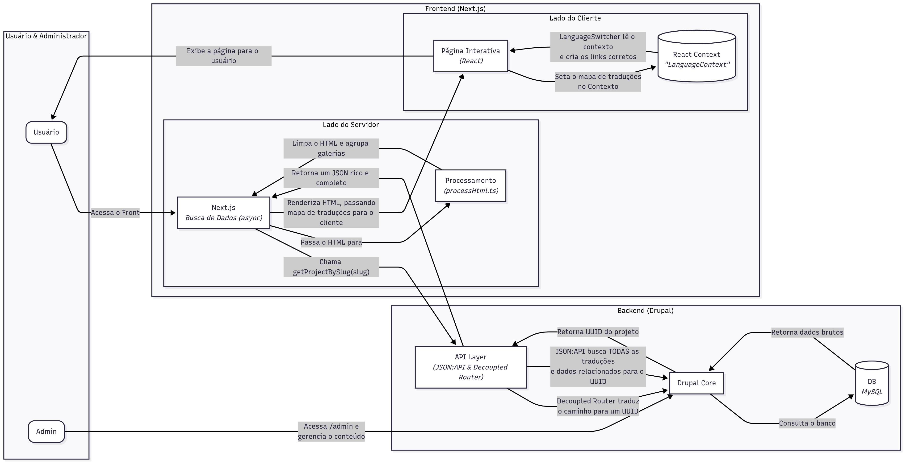

## Portfólio com Arquitetura Headless

Meu portfólio foi desenvolvido com uma arquitetura desacoplada para demonstrar proficiência em tecnologias modernas de frontend e backend, além de boas práticas de desenvolvimento e deploy.

- [Ver Projeto](https://portfolio-lc-rho.vercel.app)

## 🚀 Sobre o Projeto

Este não é um portfólio comum. Ele foi construído sobre uma arquitetura headless, onde as responsabilidades são claramente separadas:

- Backend (Drupal + AWS): Um backend robusto e escalável construído com Drupal 10, responsável por toda a modelagem e gerenciamento de conteúdo (projetos, páginas, traduções). Ele é hospedado na AWS, utilizando uma instância EC2 para a aplicação e um banco de dados Amazon RDS (MySQL) para garantir performance e confiabilidade. Sua única função é servir os dados através de uma API JSON.

- Frontend (Next.js + Vercel): Uma interface de usuário moderna, rápida e interativa, construída com Next.js 15+ e TypeScript. Ela consome os dados da API do Drupal e é responsável por toda a renderização e experiência do usuário. O deploy é feito na Vercel, aproveitando sua otimização para performance e Edge Network.

Essa abordagem desacoplada permite atualizações, manutenções independentes e escalabilidade.

## Diagrama de Fluxo de Dados

## ✨ Principais Funcionalidades

- **Gerenciamento de Conteúdo Headless:** Todo o conteúdo é gerenciado no Drupal, permitindo uma edição fácil sem a necessidade de fazer deploy do frontend.

- **Internacionalização:** Suporte completo para múltiplos idiomas (Português e Inglês), com tradução de slugs e conteúdo.

- **Galerias de Imagem Dinâmicas:** Imagens inseridas em sequência no editor do Drupal são automaticamente agrupadas em um grid moderno no frontend.
## 🛠️ Tecnologias Utilizadas

**Frontend**

- Framework: Next.js (com App Router)

- Linguagem: TypeScript

- Estilização: Tailwind CSS v4

- Animação: Framer Motion

- Parse de HTML: html-react-parser

- Gerenciamento de Tema: next-themes

**Backend**

- CMS: Drupal 10

- API: Módulos JSON:API e Decoupled Router

**Banco de Dados**

- Produção: Amazon RDS (MySQL)

- Desenvolvimento Local: MySQL (via Lando)

**Infraestrutura e Deploy**

- Backend: Amazon EC2

- Frontend: Vercel

- Ambiente de Dev Local: Lando
## 📖 Documentação

Caso queira maiores informações, acesse a documentação completa. [Documentação](doc/Arquitetura%20e%20Desenvolvimento.md)